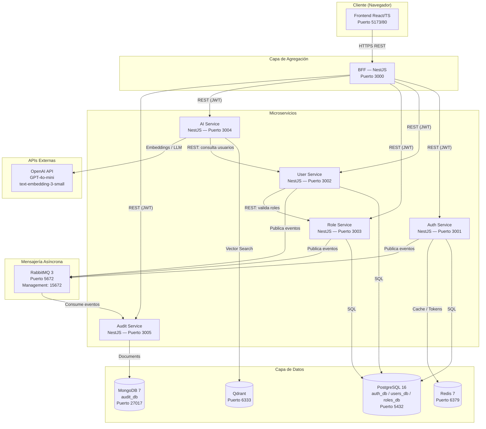
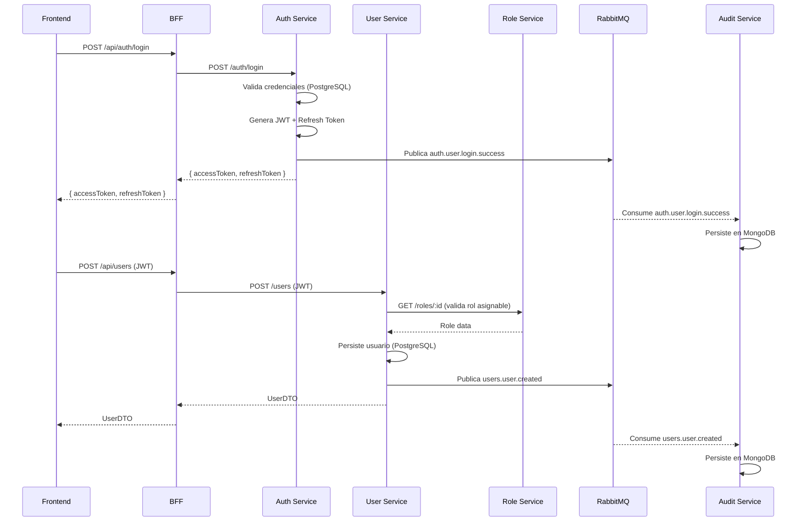

# Design — Sistema de Gestión de Usuarios con Microservicios e IA

> Basado en: `requirements.md` — Prueba Técnica Senior Full-Stack Engineer (IA) — Toka, 2025-11-11

---

## Índice

1. [Visión General y Principios Arquitectónicos](#1-visión-general-y-principios-arquitectónicos)
2. [Decisiones Técnicas Justificadas](#2-decisiones-técnicas-justificadas)
3. [Diagrama de Arquitectura del Sistema](#3-diagrama-de-arquitectura-del-sistema)
4. [Diseño de Microservicios](#4-diseño-de-microservicios)
   - 4.1 Auth Service
   - 4.2 User Service
   - 4.3 Role Service
   - 4.4 Audit Service
   - 4.5 AI Service
   - 4.6 BFF (Backend For Frontend)
5. [Estrategia Multi-DB](#5-estrategia-multi-db)
6. [Diseño de Comunicación](#6-diseño-de-comunicación)
7. [Arquitectura de Seguridad y JWT](#7-arquitectura-de-seguridad-y-jwt)
8. [Arquitectura del Frontend](#8-arquitectura-del-frontend)
9. [Arquitectura de IA y RAG](#9-arquitectura-de-ia-y-rag)
10. [Estrategia de Prompt Engineering](#10-estrategia-de-prompt-engineering)
11. [Infraestructura Docker Compose](#11-infraestructura-docker-compose)
12. [Observabilidad y Logging](#12-observabilidad-y-logging)
13. [Estrategia de Testing](#13-estrategia-de-testing)
14. [Patrones de Resiliencia](#14-patrones-de-resiliencia)
15. [Estructura de Directorios (Monorepo)](#15-estructura-de-directorios-monorepo)
16. [Flujos de Datos End-to-End](#16-flujos-de-datos-end-to-end)
17. [Plan de Diagnóstico Operacional (Ejercicio 4)](#17-plan-de-diagnóstico-operacional-ejercicio-4)

---

## 1. Visión General y Principios Arquitectónicos

### 1.1 Descripción del sistema

El sistema es una plataforma de **gestión de usuarios con control de acceso basado en roles (RBAC)**, auditoría de operaciones y un agente de inteligencia artificial con capacidad RAG. Se compone de seis microservicios independientes, una SPA React y toda la infraestructura auxiliar orquestada por Docker Compose.

### 1.2 Principios que rigen el diseño

| Principio | Aplicación concreta |
|---|---|
| **Autonomía** | Cada microservicio tiene su propia BD, Dockerfile y ciclo de vida. Ninguno importa código de otro. |
| **DDD** | Cada servicio modela su propio dominio: entidades, value objects, servicios de dominio y repositorios por interfaz. |
| **Clean Architecture** | Las dependencias siempre apuntan hacia el dominio. La capa de infraestructura implementa interfaces del dominio. |
| **CQRS** | Auth Service, User Service y Role Service separan comandos (escritura) de queries (lectura) mediante buses dedicados. |
| **Contrato primero** | Los servicios se comunican por contratos (DTOs/schemas de eventos). Un cambio interno no rompe el contrato. |
| **Bajo acoplamiento** | Los servicios no se llaman entre sí directamente en la capa de dominio. La orquestación ocurre en la capa de aplicación. |
| **Observabilidad** | Todo evento relevante produce un log JSON estructurado con correlation ID. |
| **Seguridad por diseño** | Ningún endpoint es público salvo los de autenticación. La validación de JWT ocurre localmente en cada servicio. |

---

## 2. Decisiones Técnicas Justificadas

### 2.1 Backend: NestJS (Node.js + TypeScript)

**Elección**: NestJS con TypeScript para los seis microservicios backend.

**Justificación**:
- TypeScript unifica el stack completo (backend + frontend), maximizando reutilización de tipos y contratos.
- NestJS provee inyección de dependencias nativa, ideal para Clean Architecture (inyectar implementaciones de repositorios).
- `@nestjs/cqrs` implementa CQRS con CommandBus y QueryBus sin librerías externas.
- `@nestjs/microservices` soporta transporte RabbitMQ nativo (AMQP).
- Módulos bien delimitados mapean 1:1 con bounded contexts DDD.
- Ecosistema maduro: TypeORM, Mongoose, Passport, clase-validator, winston.

**Alternativa descartada**: Python/FastAPI (excelente para AI, pero genera inconsistencia de stack en servicios no-AI). C#/.NET 8 (muy capaz pero más verboso para un mono-repo con 6 servicios en tiempo limitado).

### 2.2 ORM: TypeORM

**Elección**: TypeORM para PostgreSQL en Auth, User y Role Service.

**Justificación**:
- Soporte nativo de TypeScript con decoradores de entidades.
- Migrations automáticas (`synchronize: false` en producción, `true` en dev local).
- Repository pattern alineado con DDD: `UserRepository extends Repository<UserEntity>`.
- Alternativa: Prisma (más ergonómico pero menos alineado con el patrón Repository del DDD clásico).

**Para MongoDB (Audit Service)**: Mongoose con schemas tipados, elegido por su API document-first y flexibilidad de schema.

### 2.3 Base de datos relacional: PostgreSQL 16

**Elección**: PostgreSQL 16 (una instancia con tres bases de datos: `auth_db`, `users_db`, `roles_db`).

**Justificación**:
- Open source, robusto, soporte completo de transacciones ACID.
- Una instancia con múltiples databases en lugar de tres contenedores separados: reduce consumo de recursos en local sin sacrificar aislamiento lógico. En producción cada DB viviría en su propio servidor.
- Soporte nativo de UUID, JSONB y tipos avanzados.

### 2.4 Mensajería: RabbitMQ

**Elección**: RabbitMQ 3 con plugin de management.

**Justificación**:
- Más sencillo de operar localmente que Kafka (que requiere ZooKeeper o KRaft + mayor overhead).
- Soporte nativo en `@nestjs/microservices` con transporte AMQP.
- Exchange tipo `topic` permite enrutado flexible de eventos por routing key.
- Dead-letter queues integradas.
- UI de management en puerto 15672 para debugging visual.

### 2.5 Cache: Redis 7

**Elección**: Redis 7 (modo standalone).

**Justificación**:
- Almacenamiento de refresh tokens con TTL nativo.
- Caching de resolución de permisos (evita llamadas repetidas al Role Service en cada request).
- Posibilidad de blacklisting de tokens revocados.

### 2.6 Vector DB: Qdrant

**Elección**: Qdrant (contenedor Docker local).

**Justificación**:
- Disponible como imagen Docker oficial, sin necesidad de API key externa.
- API REST y gRPC, compatible con LangChain.js.
- Soporte de filtros por payload (permite filtrar chunks por fuente de documento).
- Alternativa descartada: Chroma (menos features de filtrado), Pinecone (requiere cuenta externa).

### 2.7 AI Provider: OpenAI

**Elección**: OpenAI API (GPT-4o-mini para LLM, text-embedding-3-small para embeddings).

**Justificación**:
- GPT-4o-mini: excelente relación calidad/coste para consultas de gestión de usuarios.
- text-embedding-3-small: 1536 dimensiones, bajo coste por token, alta calidad semántica.
- Alternativa: Anthropic Claude (también excelente, pero OpenAI tiene mayor integración en LangChain.js y más documentación de ejemplos RAG).

### 2.8 AI Framework: LangChain.js

**Elección**: LangChain.js v0.3.

**Justificación**:
- Mismo ecosistema TypeScript del resto del proyecto.
- Abstracciones nativas para RAG: `VectorStoreRetriever`, `RetrievalQAChain`, `ConversationalRetrievalQAChain`.
- Integración directa con Qdrant (`QdrantVectorStore`).
- `TokenTextSplitter` para chunking de documentos.
- Callbacks nativos para captura de métricas (latencia, tokens).

### 2.9 Frontend: React + Vite + Redux Toolkit

**Elección**: React 18 con TypeScript, Vite como bundler y Redux Toolkit con RTK Query.

**Justificación**:
- Vite: arranque instantáneo en dev, HMR rápido.
- RTK Query (parte de Redux Toolkit): gestión automática de estados loading/error/success por endpoint, caché de respuestas, invalidación selectiva. Elimina boilerplate de async thunks.
- Redux Toolkit: slice pattern reduce el boilerplate de Redux clásico.

---

## 3. Diagrama de Arquitectura del Sistema

### 3.1 Vista general



### 3.2 Vista de comunicación síncrona vs. asíncrona



---

## 4. Diseño de Microservicios

### Estructura de capas común (Clean Architecture + DDD)

Todos los microservicios backend siguen esta estructura de capas. Las dependencias SIEMPRE apuntan hacia el interior (dominio):

```
┌──────────────────────────────────────────────────────┐
│  INFRASTRUCTURE (implementa interfaces del dominio)  │
│  - TypeORM / Mongoose repositories                   │
│  - Redis client                                      │
│  - RabbitMQ publisher/consumer                       │
│  - HTTP clients externos (axios)                     │
│  - NestJS controllers, guards, pipes, interceptors   │
└──────────────────────────┬───────────────────────────┘
                           │ implementa interfaces de ↓
┌──────────────────────────▼───────────────────────────┐
│  APPLICATION (orquesta casos de uso)                 │
│  - Commands + CommandHandlers (CQRS)                 │
│  - Queries + QueryHandlers (CQRS)                    │
│  - Application Services (saga/coordinación)          │
│  - DTOs de entrada/salida                            │
│  - Event handlers de dominio                         │
└──────────────────────────┬───────────────────────────┘
                           │ usa ↓
┌──────────────────────────▼───────────────────────────┐
│  DOMAIN (núcleo puro, sin dependencias externas)     │
│  - Entities (con lógica de negocio)                  │
│  - Value Objects (inmutables)                        │
│  - Domain Services                                   │
│  - Repository Interfaces                             │
│  - Domain Events                                     │
│  - Aggregates                                        │
└──────────────────────────────────────────────────────┘
```

---

### 4.1 Auth Service

**Puerto**: 3001 | **DB**: PostgreSQL (`auth_db`) + Redis | **Bounded Context**: Identidad y Acceso

#### 4.1.1 Dominio

**Aggregate Root: `UserCredentials`**
```
UserCredentials
  ├── id: UUID (Identity)
  ├── email: Email (Value Object — valida formato RFC 5322)
  ├── passwordHash: PasswordHash (Value Object — bcrypt, cost 12)
  ├── isActive: boolean
  ├── createdAt: Date
  └── updatedAt: Date

Métodos de dominio:
  - verifyPassword(plain: string): boolean
  - deactivate(): void
  - reactivate(): void
```

**Value Objects**:
- `Email`: valida formato, normaliza a lowercase.
- `PasswordHash`: encapsula bcrypt, expone solo `verify()` y `create()`.

**Domain Events**:
- `UserRegisteredEvent { userId, email, timestamp }`
- `UserLoggedInEvent { userId, email, ip, timestamp }`
- `UserLoginFailedEvent { email, ip, reason, timestamp }`
- `UserLoggedOutEvent { userId, timestamp }`

**Repository Interface**:
```typescript
interface ICredentialsRepository {
  findByEmail(email: Email): Promise<UserCredentials | null>;
  save(credentials: UserCredentials): Promise<void>;
  delete(id: UUID): Promise<void>;
}
```

#### 4.1.2 Aplicación (CQRS)

**Commands**:
| Command | Handler | Descripción |
|---|---|---|
| `RegisterUserCommand` | `RegisterUserHandler` | Crea credenciales, emite `UserRegisteredEvent` |
| `LoginCommand` | `LoginHandler` | Valida credenciales, genera JWT + RefreshToken, emite `UserLoggedInEvent` |
| `LogoutCommand` | `LogoutHandler` | Invalida RefreshToken en Redis, emite `UserLoggedOutEvent` |
| `RefreshTokenCommand` | `RefreshTokenHandler` | Valida RefreshToken, emite nuevo AccessToken |

**Queries**:
| Query | Handler | Descripción |
|---|---|---|
| `ValidateTokenQuery` | `ValidateTokenHandler` | Valida firma JWT localmente (sin DB) |

#### 4.1.3 Infraestructura

**Endpoints REST**:
```
POST   /auth/register          → RegisterUserCommand
POST   /auth/login             → LoginCommand
POST   /auth/logout            → LogoutCommand  [JWT required]
POST   /auth/refresh           → RefreshTokenCommand
GET    /auth/validate          → ValidateTokenQuery  [internal use]
```

**Redis Keys**:
```
refresh_token:{userId}:{tokenId}   TTL: 7 días
token_blacklist:{jti}              TTL: tiempo restante del access token
permissions_cache:{userId}         TTL: 5 minutos
```

**Eventos publicados a RabbitMQ**:
```
Routing key: auth.user.registered      Payload: UserRegisteredEvent
Routing key: auth.user.login.success   Payload: UserLoggedInEvent
Routing key: auth.user.login.failed    Payload: UserLoginFailedEvent
Routing key: auth.user.logout          Payload: UserLoggedOutEvent
```

#### 4.1.4 JWT Design

```typescript
// Access Token — TTL: 15 minutos
interface AccessTokenPayload {
  sub: string;        // userId (UUID)
  email: string;
  roles: string[];    // nombres de roles
  permissions: string[]; // ej: ["users:read", "roles:write"]
  jti: string;        // JWT ID único (para blacklisting)
  iat: number;
  exp: number;
}

// Refresh Token — TTL: 7 días, almacenado en Redis
interface RefreshTokenPayload {
  sub: string;
  tokenId: string;    // UUID único por sesión
  iat: number;
  exp: number;
}
```

**Firma**: HS256 con `JWT_SECRET` de 256 bits mínimo. En producción: RS256 con par de claves.

---

### 4.2 User Service

**Puerto**: 3002 | **DB**: PostgreSQL (`users_db`) | **Bounded Context**: Gestión de Usuarios

#### 4.2.1 Dominio

**Aggregate Root: `User`**
```
User
  ├── id: UUID (Identity)
  ├── name: FullName (Value Object)
  ├── email: Email (Value Object)
  ├── status: UserStatus (Enum: ACTIVE | INACTIVE)
  ├── roleIds: UUID[] (referencias a Role Service)
  ├── createdAt: Date
  └── updatedAt: Date

Métodos de dominio:
  - activate(): void
  - deactivate(): void
  - assignRole(roleId: UUID): void   // emite UserRoleAssignedEvent
  - removeRole(roleId: UUID): void   // emite UserRoleRemovedEvent
  - update(name: FullName, email: Email): void
```

**Value Objects**:
- `FullName`: nombre + apellido, no vacío, max 100 chars.
- `Email`: mismo VO compartible como tipo, no como clase importada entre servicios.
- `UserStatus`: enum con transiciones válidas (ACTIVE → INACTIVE → ACTIVE).

**Domain Events**:
- `UserCreatedEvent { userId, name, email, timestamp }`
- `UserUpdatedEvent { userId, changes, timestamp }`
- `UserDeletedEvent { userId, timestamp }`
- `UserRoleAssignedEvent { userId, roleId, timestamp }`
- `UserRoleRemovedEvent { userId, roleId, timestamp }`

**Repository Interface**:
```typescript
interface IUserRepository {
  findById(id: UUID): Promise<User | null>;
  findAll(filter: UserFilter): Promise<PaginatedResult<User>>;
  findByEmail(email: Email): Promise<User | null>;
  save(user: User): Promise<void>;
  delete(id: UUID): Promise<void>;
}
```

#### 4.2.2 Aplicación (CQRS)

**Commands**:
| Command | Handler |
|---|---|
| `CreateUserCommand` | `CreateUserHandler` — valida email único, llama Role Service para roles iniciales |
| `UpdateUserCommand` | `UpdateUserHandler` |
| `DeleteUserCommand` | `DeleteUserHandler` |
| `AssignRoleCommand` | `AssignRoleHandler` — llama REST a Role Service para validar que el roleId existe |
| `RemoveRoleCommand` | `RemoveRoleHandler` |

**Queries**:
| Query | Handler |
|---|---|
| `GetUserQuery` | `GetUserHandler` |
| `GetUsersQuery` | `GetUsersHandler` — soporta paginación y filtros |
| `GetUserRolesQuery` | `GetUserRolesHandler` — llama REST a Role Service para resolver detalles |

#### 4.2.3 Infraestructura

**Endpoints REST** (todos requieren JWT válido):
```
GET    /users                  → GetUsersQuery        [requiere: users:read]
GET    /users/:id              → GetUserQuery         [requiere: users:read]
POST   /users                  → CreateUserCommand    [requiere: users:write]
PUT    /users/:id              → UpdateUserCommand    [requiere: users:write]
DELETE /users/:id              → DeleteUserCommand    [requiere: users:delete]
POST   /users/:id/roles        → AssignRoleCommand    [requiere: users:write]
DELETE /users/:id/roles/:roleId→ RemoveRoleCommand    [requiere: users:write]
GET    /users/:id/roles        → GetUserRolesQuery    [requiere: users:read]
```

**Integración síncrona con Role Service**:
- `GET http://role-service:3003/roles/:id` → verificar existencia del rol antes de asignar.
- Timeout: 3s. En caso de timeout: retornar error 503 al cliente.

**Eventos publicados a RabbitMQ**:
```
users.user.created
users.user.updated
users.user.deleted
users.user.role.assigned
users.user.role.removed
```

---

### 4.3 Role Service

**Puerto**: 3003 | **DB**: PostgreSQL (`roles_db`) | **Bounded Context**: Autorización y Permisos

#### 4.3.1 Dominio

**Aggregate Root: `Role`**
```
Role
  ├── id: UUID
  ├── name: RoleName (Value Object — único, sin espacios, uppercase)
  ├── description: string
  ├── permissions: Permission[] (Value Object collection)
  ├── isSystem: boolean  // roles del sistema no pueden eliminarse
  ├── createdAt: Date
  └── updatedAt: Date

Métodos de dominio:
  - addPermission(permission: Permission): void
  - removePermission(permission: Permission): void
  - rename(name: RoleName): void
```

**Value Objects**:
- `RoleName`: string uppercase sin espacios (ej: `ADMIN`, `USER`, `AUDITOR`).
- `Permission`: string con formato `resource:action` (ej: `users:read`, `roles:write`).

**Domain Events**:
- `RoleCreatedEvent { roleId, name, permissions, timestamp }`
- `RoleUpdatedEvent { roleId, changes, timestamp }`
- `RoleDeletedEvent { roleId, timestamp }`

**Repository Interface**:
```typescript
interface IRoleRepository {
  findById(id: UUID): Promise<Role | null>;
  findByName(name: RoleName): Promise<Role | null>;
  findAll(): Promise<Role[]>;
  save(role: Role): Promise<void>;
  delete(id: UUID): Promise<void>;
}
```

#### 4.3.2 Aplicación (CQRS)

**Commands**: `CreateRoleCommand`, `UpdateRoleCommand`, `DeleteRoleCommand`, `AddPermissionCommand`, `RemovePermissionCommand`

**Queries**: `GetRoleQuery`, `GetRolesQuery`, `GetRolePermissionsQuery`

#### 4.3.3 Infraestructura

**Endpoints REST** (todos requieren JWT válido):
```
GET    /roles                  → GetRolesQuery         [requiere: roles:read]
GET    /roles/:id              → GetRoleQuery           [requiere: roles:read]
GET    /roles/:id/permissions  → GetRolePermissionsQuery[requiere: roles:read]
POST   /roles                  → CreateRoleCommand      [requiere: roles:write]
PUT    /roles/:id              → UpdateRoleCommand      [requiere: roles:write]
DELETE /roles/:id              → DeleteRoleCommand      [requiere: roles:delete]
POST   /roles/:id/permissions  → AddPermissionCommand   [requiere: roles:write]
DELETE /roles/:id/permissions/:perm→ RemovePermissionCommand [requiere: roles:write]
```

**Roles de sistema predefinidos** (seed en startup):
```
SUPER_ADMIN   → todos los permisos
ADMIN         → users:*, roles:read, audit:read
USER          → users:read (solo su propio perfil)
AUDITOR       → audit:read, users:read
```

**Eventos publicados a RabbitMQ**:
```
roles.role.created
roles.role.updated
roles.role.deleted
```

---

### 4.4 Audit Service

**Puerto**: 3005 | **DB**: MongoDB (`audit_db`) | **Bounded Context**: Auditoría y Trazabilidad

#### 4.4.1 Características especiales

- **Solo escritura vía eventos**: no acepta POST REST para crear registros. Solo consume de RabbitMQ.
- **Solo lectura vía REST**: expone endpoints GET para consultas.
- Diseñado para alta tasa de inserción y consultas analíticas.

#### 4.4.2 Dominio

**Document: `AuditLog`** (Mongoose Schema)
```typescript
interface AuditLog {
  _id: ObjectId;
  eventType: string;          // "auth.user.login.success"
  service: string;            // "auth-service"
  userId: string | null;      // null si no hay usuario (ej: login fallido)
  actorEmail: string | null;
  resourceType: string;       // "user", "role", "session"
  resourceId: string | null;
  action: string;             // "login", "create", "update", "delete"
  status: "success" | "failure";
  metadata: Record<string, unknown>;  // payload adicional (ip, userAgent, etc.)
  correlationId: string;
  timestamp: Date;
}
```

**Índices MongoDB**:
```
{ timestamp: -1 }                    // queries por rango de tiempo
{ userId: 1, timestamp: -1 }         // historial de usuario
{ eventType: 1, timestamp: -1 }      // filtro por tipo
{ service: 1, timestamp: -1 }        // filtro por servicio
```

#### 4.4.3 Infraestructura

**Consumidor RabbitMQ**:
- Queue: `audit.events.queue`
- Exchange: `toka.events` (topic)
- Binding: `#` (consume todos los routing keys)
- Dead-letter exchange: `toka.dlx`
- Dead-letter queue: `audit.dlq`
- Prefetch: 10 mensajes (procesamiento concurrente controlado)

**Endpoints REST** (requieren JWT con permiso `audit:read`):
```
GET /audit/logs                     → lista paginada con filtros
GET /audit/logs/:id                 → registro específico
GET /audit/logs/user/:userId        → historial de usuario
GET /audit/logs/stats               → estadísticas agregadas
```

**Query params soportados** en `GET /audit/logs`:
```
page, limit, startDate, endDate, userId, eventType, service, status
```

---

### 4.5 AI Service

**Puerto**: 3004 | **DB**: Qdrant (vector DB) | **Bounded Context**: Inteligencia Aumentada

#### 4.5.1 Responsabilidades

1. Indexar documentos del sistema en Qdrant (pipeline de embeddings).
2. Recibir consultas en lenguaje natural del usuario.
3. Ejecutar el pipeline RAG: embedding → búsqueda vectorial → construcción de prompt → LLM → respuesta.
4. Registrar métricas de cada interacción.
5. Integrar datos del User Service para enriquecer respuestas.

#### 4.5.2 Diseño del pipeline RAG

```
┌─────────────────────────────────────────────────────────────────┐
│                    PIPELINE DE INDEXACIÓN                       │
│  (se ejecuta al iniciar el servicio y bajo demanda)             │
├─────────────────────────────────────────────────────────────────┤
│                                                                 │
│  Fuentes de documentos:                                         │
│  ├── /docs/user-management-guide.md                             │
│  ├── /docs/roles-permissions-reference.md                       │
│  └── /docs/system-overview.md                                   │
│                         │                                       │
│                         ▼                                       │
│              TokenTextSplitter                                  │
│              (chunkSize: 500, overlap: 50)                      │
│                         │                                       │
│                         ▼                                       │
│         OpenAI text-embedding-3-small                           │
│         (genera vector 1536 dimensiones por chunk)              │
│                         │                                       │
│                         ▼                                       │
│         Qdrant Collection: "system_knowledge"                   │
│         Payload por punto: { source, chunkIndex, content }      │
│                                                                 │
└─────────────────────────────────────────────────────────────────┘

┌─────────────────────────────────────────────────────────────────┐
│                    PIPELINE DE CONSULTA (RAG)                   │
├─────────────────────────────────────────────────────────────────┤
│                                                                 │
│  1. Recibe: { query: string, userId?: string, context?: obj }   │
│                         │                                       │
│  2. Embed query         │                                       │
│     OpenAI embedding ───┘                                       │
│                         │                                       │
│  3. Vector Search en Qdrant                                     │
│     topK=5, score_threshold=0.7                                 │
│                         │                                       │
│  4. (Opcional) Enriquecer con datos en vivo                     │
│     GET user-service/users/:userId → datos actuales del usuario │
│                         │                                       │
│  5. Construir prompt (ver §10)                                  │
│     system_prompt + context_chunks + live_data + user_query     │
│                         │                                       │
│  6. Llamar OpenAI GPT-4o-mini                                   │
│     max_tokens: 800, temperature: 0.3                           │
│                         │                                       │
│  7. Medir métricas (ver §4.5.4)                                 │
│                         │                                       │
│  8. Validar respuesta (ver §4.5.5)                              │
│                         │                                       │
│  9. Retornar: { answer, sources, metrics }                      │
│                                                                 │
└─────────────────────────────────────────────────────────────────┘
```

#### 4.5.3 Endpoints REST (requieren JWT):

```
POST   /ai/query            → Ejecuta pipeline RAG completo
POST   /ai/index            → (Re)indexa documentos [requiere: ai:admin]
GET    /ai/metrics          → Métricas agregadas de uso
GET    /ai/metrics/:queryId → Métricas de una consulta específica
GET    /ai/health           → Estado de conexión con Qdrant y OpenAI
```

**Schema de request** `POST /ai/query`:
```typescript
interface AIQueryRequest {
  query: string;          // max 1000 chars
  userId?: string;        // para enriquecer contexto con datos del usuario
  sessionId?: string;     // para mantener historial de conversación
}
```

**Schema de response**:
```typescript
interface AIQueryResponse {
  answer: string;
  sources: Array<{ content: string; source: string; score: number }>;
  metrics: {
    latencyMs: number;
    inputTokens: number;
    outputTokens: number;
    estimatedCostUSD: number;
    qualityFlags: string[];   // ej: ["empty_response", "low_confidence"]
  };
  queryId: string;
}
```

#### 4.5.4 Métricas de evaluación

```typescript
interface QueryMetrics {
  queryId: string;           // UUID
  timestamp: Date;
  latencyMs: number;         // tiempo total desde request hasta response
  embeddingLatencyMs: number;
  retrievalLatencyMs: number;
  llmLatencyMs: number;
  inputTokens: number;
  outputTokens: number;
  totalTokens: number;
  estimatedCostUSD: number;  // calculado: input*0.00015 + output*0.0006 por 1k tokens
  chunksRetrieved: number;
  avgChunkScore: number;
}
```

**Cálculo de costo** (text-embedding-3-small: $0.02/1M tokens; GPT-4o-mini: $0.15/$0.60 por 1M in/out):
```
cost = (inputTokens / 1_000_000 * 0.15) + (outputTokens / 1_000_000 * 0.60)
```

#### 4.5.5 Validación de calidad

Flags de calidad (no bloquean la respuesta, se registran en métricas):
- `empty_response`: `answer.trim().length === 0`
- `too_short`: `answer.length < 50`
- `max_tokens_reached`: respuesta truncada por límite
- `low_retrieval_score`: `avgChunkScore < 0.65`
- `no_context_found`: `chunksRetrieved === 0`

---

### 4.6 BFF (Backend For Frontend)

**Puerto**: 3000 | **Sin BD propia** | **Función**: Punto de entrada único para el frontend

#### 4.6.1 Responsabilidades

1. Validar el JWT en cada request entrante (Guard compartido).
2. Extraer `userId`, `roles` y `permissions` del payload del token e inyectarlos como headers internos.
3. Hacer proxy o agregación de llamadas a los microservicios.
4. Generar `correlationId` único por request y propagarlo en headers internos.
5. Manejar timeouts y devolver errores uniformes al frontend.

#### 4.6.2 Endpoints expuestos (prefijo `/api`)

```
/api/auth/*         → proxy a Auth Service (sin validación JWT: /login, /register)
/api/users/*        → proxy a User Service
/api/roles/*        → proxy a Role Service
/api/audit/*        → proxy a Audit Service
/api/ai/*           → proxy a AI Service
```

#### 4.6.3 Headers internos (BFF → microservicios)

```
X-User-Id: {userId}
X-User-Roles: {comma-separated roles}
X-Correlation-Id: {uuid-v4}
X-Request-Timestamp: {ISO-8601}
Authorization: Bearer {original JWT}
```

#### 4.6.4 Respuesta de error uniforme

```typescript
interface ErrorResponse {
  statusCode: number;
  error: string;
  message: string;
  correlationId: string;
  timestamp: string;
}
```

---

## 5. Estrategia Multi-DB

### 5.1 Mapa de persistencia

| Dato | Tecnología | Justificación |
|---|---|---|
| Credenciales de usuario | PostgreSQL `auth_db` | Transaccional, relacional, ACID |
| Refresh tokens | Redis | TTL nativo, acceso O(1), volatilidad esperada |
| Caché de permisos | Redis | Evita llamadas repetidas al Role Service |
| Token blacklist | Redis | TTL = tiempo restante del access token |
| Perfiles de usuario | PostgreSQL `users_db` | Relacional, joins con roles |
| Roles y permisos | PostgreSQL `roles_db` | Relacional, integridad referencial |
| Registros de auditoría | MongoDB `audit_db` | Schema flexible, alto volumen escrituras, sin joins |
| Vectores de embeddings | Qdrant | Vector similarity search, filtros por payload |

### 5.2 Estrategia de migración PostgreSQL

- Desarrollo local: `synchronize: true` en TypeORM (TypeORM sincroniza el schema al arrancar).
- Pre-producción/producción: `synchronize: false` + migrations explícitas con `typeorm migration:generate` y `typeorm migration:run`.

### 5.3 Inicialización de datos (Seeds)

Al primer arranque del sistema:
1. **Role Service**: crea roles del sistema (`SUPER_ADMIN`, `ADMIN`, `USER`, `AUDITOR`) con sus permisos.
2. **Auth Service**: crea usuario admin inicial (desde variables de entorno: `SEED_ADMIN_EMAIL`, `SEED_ADMIN_PASSWORD`).
3. **AI Service**: ejecuta pipeline de indexación de documentos en Qdrant.

---

## 6. Diseño de Comunicación

### 6.1 Comunicación Síncrona (REST)

**Protocolo**: HTTP/1.1, JSON, UTF-8.

**Casos de uso** (REST entre microservicios):
| Llamante | Receptor | Endpoint | Propósito |
|---|---|---|---|
| BFF | Auth Service | `POST /auth/login` | Autenticación |
| BFF | User Service | `GET|POST|PUT|DELETE /users/*` | CRUD usuarios |
| BFF | Role Service | `GET|POST|PUT|DELETE /roles/*` | CRUD roles |
| BFF | Audit Service | `GET /audit/logs/*` | Consulta de auditoría |
| BFF | AI Service | `POST /ai/query` | Consulta al agente |
| User Service | Role Service | `GET /roles/:id` | Validar rol antes de asignar |
| AI Service | User Service | `GET /users/:id` | Enriquecer contexto con datos de usuario |

**Timeout policy** (entre microservicios):
- Llamadas normales (User ↔ Role): 3 segundos.
- Llamadas al AI Service: 30 segundos (por latencia de LLM).
- Reintentos: máximo 2 reintentos con backoff (500ms, 1000ms).

**Formato de error REST estándar** (todos los servicios):
```json
{
  "statusCode": 404,
  "error": "Not Found",
  "message": "User with id 'xyz' not found",
  "correlationId": "uuid-v4",
  "timestamp": "2024-01-15T10:30:00.000Z"
}
```

### 6.2 Comunicación Asíncrona (RabbitMQ)

#### 6.2.1 Topología

```
Exchange: toka.events (type: topic, durable: true)
                │
    ┌───────────┼───────────┐
    │           │           │
auth.#       users.#      roles.#
    │           │           │
    └───────────┴───────────┘
                │
    Queue: audit.events.queue (durable: true)
    Binding: # (todas las routing keys)
                │
    Dead-letter exchange: toka.dlx (type: direct)
                │
    Dead-letter queue: audit.dlq
```

#### 6.2.2 Schema de eventos (todos los eventos)

```typescript
interface DomainEvent {
  eventId: string;          // UUID único del evento
  eventType: string;        // "auth.user.login.success"
  aggregateId: string;      // ID del aggregate (userId, roleId, etc.)
  aggregateType: string;    // "UserCredentials", "User", "Role"
  occurredAt: string;       // ISO-8601
  correlationId: string;    // propagado desde el request HTTP original
  payload: Record<string, unknown>;  // datos específicos del evento
  version: number;          // versión del schema del evento (para evolución)
}
```

#### 6.2.3 Eventos por servicio

**Auth Service publica**:
```
auth.user.registered       → { userId, email }
auth.user.login.success    → { userId, email, ip, userAgent }
auth.user.login.failed     → { email, ip, reason: "invalid_credentials"|"account_inactive" }
auth.user.logout           → { userId }
auth.token.refreshed       → { userId }
```

**User Service publica**:
```
users.user.created         → { userId, name, email }
users.user.updated         → { userId, changes: { field, oldValue, newValue }[] }
users.user.deleted         → { userId, email }
users.user.role.assigned   → { userId, roleId, roleName }
users.user.role.removed    → { userId, roleId, roleName }
```

**Role Service publica**:
```
roles.role.created         → { roleId, name, permissions }
roles.role.updated         → { roleId, changes }
roles.role.deleted         → { roleId, name }
```

#### 6.2.4 Manejo de errores en mensajería

- **Prefetch count**: 10 (Audit Service no acumula más de 10 mensajes en proceso).
- **Reintentos**: 3 intentos con delay incremental (1s, 5s, 30s) usando `x-retry-count` en headers.
- **Dead-letter**: tras 3 fallos, el mensaje pasa a `audit.dlq` para análisis manual o reprocessing.
- **Idempotencia**: Audit Service verifica `eventId` antes de insertar (MongoDB upsert por eventId).

---

## 7. Arquitectura de Seguridad y JWT

### 7.1 Flujo completo de autenticación

```
1. REGISTRO
   Frontend → BFF → Auth Service
   Auth Service:
     a. Valida email único (PostgreSQL)
     b. Hashea password (bcrypt, cost 12)
     c. Persiste UserCredentials
     d. Publica auth.user.registered → RabbitMQ
     e. Retorna: { userId, email }

2. LOGIN
   Frontend → BFF → Auth Service
   Auth Service:
     a. Busca UserCredentials por email
     b. Verifica password con bcrypt.compare()
     c. Verifica que la cuenta está activa
     d. Genera AccessToken (JWT, TTL 15min)
     e. Genera RefreshToken (UUID, TTL 7 días)
     f. Almacena RefreshToken en Redis: refresh_token:{userId}:{tokenId}
     g. (Opcional) Pre-carga permisos en Redis: permissions_cache:{userId}
     h. Publica auth.user.login.success → RabbitMQ
     i. Retorna: { accessToken, refreshToken, expiresIn: 900 }

3. REQUEST AUTENTICADO
   Frontend → BFF:
     a. BFF extrae JWT del header Authorization: Bearer {token}
     b. BFF valida firma localmente (sin llamada a Auth Service ni DB)
     c. BFF verifica expiración
     d. BFF verifica si jti está en blacklist (Redis: token_blacklist:{jti})
     e. BFF inyecta headers internos y hace proxy al microservicio
     f. Microservicio re-valida JWT localmente (mismo proceso, sin DB)
     g. Microservicio verifica permisos del payload contra el endpoint

4. REFRESH TOKEN
   Frontend → BFF → Auth Service:
     a. Auth Service valida RefreshToken en Redis
     b. Invalida RefreshToken anterior
     c. Genera nuevo AccessToken + RefreshToken
     d. Almacena nuevo RefreshToken en Redis

5. LOGOUT
   Frontend → BFF → Auth Service:
     a. Auth Service extrae jti del AccessToken
     b. Almacena jti en Redis blacklist con TTL = tiempo restante del token
     c. Elimina RefreshToken de Redis
     d. Publica auth.user.logout → RabbitMQ
```

### 7.2 Guards de NestJS

**`JwtAuthGuard`** (en BFF y todos los microservicios):
- Extiende `AuthGuard('jwt')` de Passport.
- Verifica firma, expiración y blacklist.
- Inyecta `req.user` con el payload decodificado.

**`PermissionsGuard`** (en todos los microservicios):
- Lee `@RequirePermissions('users:write')` del decorator.
- Verifica que `req.user.permissions` incluya el permiso requerido.

**`RolesGuard`** (en todos los microservicios):
- Lee `@Roles('ADMIN', 'SUPER_ADMIN')` del decorator.
- Verifica que `req.user.roles` incluya al menos uno.

### 7.3 Seguridad OWASP

| Vulnerabilidad OWASP | Medida implementada |
|---|---|
| SQLi | TypeORM usa prepared statements siempre. Nunca string concatenation en queries. |
| XSS | `class-validator` sanitiza strings. Response headers: `X-Content-Type-Options`, `X-XSS-Protection`. |
| CSRF | JWT en header (no cookie) elimina el riesgo de CSRF. |
| Inyección | `class-transformer` whitelist de propiedades. DTOs con `@IsString()`, `@MaxLength()`, etc. |
| Broken Auth | JWT con TTL corto + blacklist + refresh tokens. bcrypt cost 12. |
| Sensitive Data | Passwords nunca en logs ni responses. API keys solo en env vars. |
| Security Misconfiguration | `helmet()` en todos los servicios. CORS restrictivo. |
| Rate Limiting | `@nestjs/throttler`: 100 req/min por IP en BFF. 10 req/min en `/auth/login`. |
| Mass Assignment | DTOs con `whitelist: true` en `ValidationPipe`. |

---

## 8. Arquitectura del Frontend

### 8.1 Estructura de directorios

```
frontend/
├── public/
├── src/
│   ├── app/
│   │   ├── store.ts              ← configuración de Redux store
│   │   ├── hooks.ts              ← useAppDispatch, useAppSelector tipados
│   │   └── router.tsx            ← React Router v6 con rutas protegidas
│   │
│   ├── features/
│   │   ├── auth/
│   │   │   ├── authSlice.ts      ← estado de sesión (user, token, isAuthenticated)
│   │   │   ├── authApi.ts        ← RTK Query: login, register, logout, refresh
│   │   │   ├── hooks/
│   │   │   │   └── useAuth.ts
│   │   │   └── components/
│   │   │       ├── LoginForm.tsx
│   │   │       └── LogoutButton.tsx
│   │   │
│   │   ├── users/
│   │   │   ├── usersApi.ts       ← RTK Query: CRUD endpoints
│   │   │   ├── hooks/
│   │   │   │   └── useUsers.ts
│   │   │   └── components/
│   │   │       ├── UserList.tsx
│   │   │       ├── UserForm.tsx
│   │   │       ├── UserDetail.tsx
│   │   │       └── RoleAssignmentModal.tsx
│   │   │
│   │   ├── roles/
│   │   │   ├── rolesApi.ts
│   │   │   └── components/
│   │   │       ├── RoleList.tsx
│   │   │       ├── RoleForm.tsx
│   │   │       └── PermissionsEditor.tsx
│   │   │
│   │   ├── audit/
│   │   │   ├── auditApi.ts
│   │   │   └── components/
│   │   │       ├── AuditLogTable.tsx
│   │   │       └── AuditFilters.tsx
│   │   │
│   │   └── ai/
│   │       ├── aiApi.ts
│   │       └── components/
│   │           ├── AIAssistantChat.tsx
│   │           └── MetricsBadge.tsx
│   │
│   ├── shared/
│   │   ├── components/
│   │   │   ├── LoadingSpinner.tsx
│   │   │   ├── ErrorMessage.tsx
│   │   │   ├── ConfirmDialog.tsx
│   │   │   ├── Toast.tsx         ← feedback visual (éxito/error)
│   │   │   └── ProtectedRoute.tsx
│   │   ├── hooks/
│   │   │   └── useToast.ts
│   │   └── utils/
│   │       ├── axiosInstance.ts  ← interceptores JWT + refresh
│   │       └── formatters.ts
│   │
│   ├── pages/
│   │   ├── LoginPage.tsx
│   │   ├── DashboardPage.tsx
│   │   ├── UsersPage.tsx
│   │   ├── UserDetailPage.tsx
│   │   ├── RolesPage.tsx
│   │   ├── AuditPage.tsx
│   │   └── AIAssistantPage.tsx
│   │
│   ├── main.tsx
│   └── App.tsx
│
├── Dockerfile
├── nginx.conf
├── vite.config.ts
├── tsconfig.json
└── package.json
```

### 8.2 Estado global (Redux + RTK Query)

**State shape**:
```typescript
interface RootState {
  auth: {
    user: { id: string; email: string; roles: string[]; permissions: string[] } | null;
    accessToken: string | null;
    isAuthenticated: boolean;
  };
  // RTK Query maneja automáticamente el resto:
  // usersApi, rolesApi, auditApi, aiApi → estados loading/error/data por endpoint
}
```

**Persistencia de sesión**:
- `redux-persist` persiste el slice `auth` en `localStorage`.
- Al iniciar la app: si existe `accessToken` en store, se intenta validar (llamada a `/auth/validate`). Si expiró, se usa el `refreshToken` almacenado.
- Al logout: `persistor.purge()` limpia toda la persistencia.

### 8.3 Axios interceptors

```typescript
// Request interceptor: inyecta JWT en cada request
axiosInstance.interceptors.request.use(config => {
  const token = store.getState().auth.accessToken;
  if (token) config.headers.Authorization = `Bearer ${token}`;
  return config;
});

// Response interceptor: maneja expiración (401) con refresh automático
axiosInstance.interceptors.response.use(
  response => response,
  async error => {
    if (error.response?.status === 401 && !error.config._retry) {
      error.config._retry = true;
      const newToken = await refreshAccessToken(); // llama /auth/refresh
      error.config.headers.Authorization = `Bearer ${newToken}`;
      return axiosInstance(error.config);
    }
    return Promise.reject(error);
  }
);
```

### 8.4 Manejo de estados en UI

**Patrón por cada feature** (usando RTK Query):
```typescript
// Ejemplo en UserList.tsx
const { data: users, isLoading, isError, error } = useGetUsersQuery({ page, limit });

if (isLoading) return <LoadingSpinner />;
if (isError) return <ErrorMessage message={error.data?.message} />;
return <UserTable users={users.items} />;
```

**Toast notifications** (feedback visual):
```typescript
// Al completar una operación:
const [createUser] = useCreateUserMutation();
const handleSubmit = async (data) => {
  try {
    await createUser(data).unwrap();
    toast.success('Usuario creado exitosamente');
  } catch (err) {
    toast.error(err.data?.message ?? 'Error al crear usuario');
  }
};
```

### 8.5 Validación de formularios

**Librería**: `react-hook-form` + `zod` para schemas de validación.

```typescript
// Ejemplo: schema de creación de usuario
const createUserSchema = z.object({
  name: z.string().min(2).max(100),
  email: z.string().email('Email inválido'),
  password: z.string().min(8, 'Mínimo 8 caracteres')
             .regex(/[A-Z]/, 'Debe contener al menos una mayúscula')
             .regex(/[0-9]/, 'Debe contener al menos un número'),
  roleIds: z.array(z.string().uuid()).min(1, 'Seleccione al menos un rol'),
});
```

### 8.6 Rutas y protección

```typescript
// router.tsx
<Routes>
  <Route path="/login" element={<LoginPage />} />
  <Route element={<ProtectedRoute />}>
    <Route path="/" element={<DashboardPage />} />
    <Route path="/users" element={<UsersPage />} />
    <Route path="/users/:id" element={<UserDetailPage />} />
    <Route path="/roles" element={<RolesPage />} />
    <Route path="/audit" element={<AuditPage />} />
    <Route path="/ai" element={<AIAssistantPage />} />
  </Route>
</Routes>

// ProtectedRoute.tsx: redirige a /login si !isAuthenticated
```

### 8.7 Dockerfile del Frontend

```dockerfile
# Stage 1: build
FROM node:20-alpine AS builder
WORKDIR /app
COPY package*.json ./
RUN npm ci
COPY . .
RUN npm run build

# Stage 2: serve con Nginx
FROM nginx:alpine
COPY --from=builder /app/dist /usr/share/nginx/html
COPY nginx.conf /etc/nginx/conf.d/default.conf
EXPOSE 80
```

**nginx.conf** (SPA fallback + proxy al BFF):
```nginx
server {
  listen 80;
  root /usr/share/nginx/html;
  index index.html;

  location / {
    try_files $uri $uri/ /index.html;
  }

  location /api/ {
    proxy_pass http://bff:3000/api/;
    proxy_set_header Host $host;
    proxy_set_header X-Real-IP $remote_addr;
  }
}
```

---

## 9. Arquitectura de IA y RAG

### 9.1 Estructura del AI Service

```
ai-service/
├── src/
│   ├── domain/
│   │   ├── entities/
│   │   │   └── query-metric.entity.ts
│   │   ├── services/
│   │   │   ├── response-validator.service.ts   ← valida calidad de respuesta
│   │   │   └── cost-calculator.service.ts      ← calcula costo de tokens
│   │   └── repositories/
│   │       └── metric.repository.interface.ts
│   │
│   ├── application/
│   │   ├── use-cases/
│   │   │   ├── query-agent.use-case.ts         ← orquesta pipeline RAG
│   │   │   └── index-documents.use-case.ts     ← pipeline de indexación
│   │   └── dtos/
│   │       ├── ai-query.dto.ts
│   │       └── ai-response.dto.ts
│   │
│   ├── infrastructure/
│   │   ├── langchain/
│   │   │   ├── qdrant-vector-store.ts          ← wrapper de QdrantVectorStore
│   │   │   ├── openai-embeddings.ts            ← wrapper de OpenAIEmbeddings
│   │   │   ├── openai-llm.ts                   ← wrapper de ChatOpenAI
│   │   │   └── rag-chain.ts                    ← RetrievalQAChain configurado
│   │   ├── http-clients/
│   │   │   └── user-service.client.ts          ← llama User Service REST
│   │   ├── persistence/
│   │   │   └── typeorm/
│   │   │       └── metric.repository.ts        ← persiste métricas en PostgreSQL
│   │   └── http/
│   │       └── controllers/
│   │           └── ai.controller.ts
│   │
│   └── docs/                                   ← documentos para indexar
│       ├── user-management-guide.md
│       ├── roles-permissions-reference.md
│       └── system-overview.md
```

### 9.2 Configuración de LangChain

```typescript
// qdrant-vector-store.ts
const vectorStore = await QdrantVectorStore.fromExistingCollection(
  new OpenAIEmbeddings({ model: 'text-embedding-3-small' }),
  {
    url: process.env.QDRANT_URL,       // http://qdrant:6333
    collectionName: 'system_knowledge',
  }
);

// rag-chain.ts
const retriever = vectorStore.asRetriever({
  k: 5,
  filter: undefined,  // sin filtro por defecto; se puede filtrar por { source }
});

const chain = RetrievalQAChain.fromLLM(
  new ChatOpenAI({
    model: 'gpt-4o-mini',
    temperature: 0.3,
    maxTokens: 800,
    callbacks: [new MetricsCallback()],  // captura latencia y tokens
  }),
  retriever,
  {
    returnSourceDocuments: true,
    verbose: process.env.NODE_ENV === 'development',
  }
);
```

### 9.3 Colección Qdrant

```
Collection: system_knowledge
Vector size: 1536
Distance: Cosine

Payload schema por punto:
{
  "content": "texto del chunk",
  "source": "user-management-guide.md",
  "chunkIndex": 0,
  "totalChunks": 12,
  "indexedAt": "2024-01-15T10:00:00Z"
}
```

---

## 10. Estrategia de Prompt Engineering

### 10.1 System Prompt (base)

```
Eres un asistente especializado en el sistema de gestión de usuarios de Toka.
Tu función es responder preguntas sobre usuarios, roles, permisos y eventos de auditoría.

REGLAS:
1. Responde SOLO con información que esté en el contexto proporcionado o en los datos del sistema.
2. Si no tienes suficiente información para responder con certeza, dilo explícitamente.
3. No inventes IDs, emails, fechas ni datos de usuarios.
4. Responde en el mismo idioma en que se te hace la pregunta.
5. Si la pregunta es sobre datos en vivo de un usuario específico, usa los datos del contexto de usuario.
6. Mantén un tono profesional y conciso.
7. Si la pregunta está fuera del dominio del sistema, declínala educadamente.

CONTEXTO DEL SISTEMA:
{context}

DATOS DEL USUARIO (si están disponibles):
{user_data}
```

### 10.2 Prompt Template por caso de uso

**Consulta general del sistema**:
```
Sistema: {system_prompt con context recuperado de Qdrant}
Usuario: {query}
```

**Consulta sobre un usuario específico**:
```
Sistema: {system_prompt}
Contexto adicional: El usuario consultado tiene los siguientes datos actuales:
  - Nombre: {user.name}
  - Email: {user.email}
  - Estado: {user.status}
  - Roles asignados: {user.roles.join(', ')}
  - Creado: {user.createdAt}
Usuario: {query}
```

**Few-shot examples** (incluidos en el system prompt para casos de baja confianza):
```
Ejemplo 1:
Pregunta: ¿Qué permisos tiene el rol ADMIN?
Respuesta: El rol ADMIN tiene los siguientes permisos: users:read, users:write, users:delete, roles:read, audit:read.

Ejemplo 2:
Pregunta: ¿Cómo asigno un rol a un usuario?
Respuesta: Para asignar un rol, ve a la sección Usuarios, selecciona el usuario y haz clic en "Gestionar Roles". Desde ahí puedes seleccionar uno o más roles de la lista disponible.
```

### 10.3 Chain-of-thought (consultas complejas)

Para preguntas que requieran análisis (ej: "¿Por qué este usuario no puede acceder al sistema?"):
```
Piensa paso a paso:
1. ¿Cuál es el estado del usuario? (activo/inactivo)
2. ¿Tiene roles asignados?
3. ¿Los roles tienen los permisos necesarios?
4. ¿Hay eventos de login fallido recientes en auditoría?
Basándote en estos pasos, proporciona una respuesta estructurada.
```

---

## 11. Infraestructura Docker Compose

### 11.1 Servicios y puertos

| Servicio | Imagen | Puerto host | Puerto container |
|---|---|---|---|
| `frontend` | build local | 80 | 80 |
| `bff` | build local | 3000 | 3000 |
| `auth-service` | build local | 3001 | 3001 |
| `user-service` | build local | 3002 | 3002 |
| `role-service` | build local | 3003 | 3003 |
| `ai-service` | build local | 3004 | 3004 |
| `audit-service` | build local | 3005 | 3005 |
| `postgres` | postgres:16-alpine | 5432 | 5432 |
| `mongodb` | mongo:7 | 27017 | 27017 |
| `redis` | redis:7-alpine | 6379 | 6379 |
| `rabbitmq` | rabbitmq:3-management-alpine | 5672, 15672 | 5672, 15672 |
| `qdrant` | qdrant/qdrant:latest | 6333, 6334 | 6333, 6334 |

### 11.2 Redes Docker

```yaml
networks:
  frontend-net:     # frontend ↔ bff únicamente
  backend-net:      # todos los microservicios entre sí
  data-net:         # microservicios ↔ bases de datos
```

### 11.3 Estructura de docker-compose.yml

```yaml
version: '3.9'

services:
  # ── Infraestructura ─────────────────────────────────
  postgres:
    image: postgres:16-alpine
    environment:
      POSTGRES_USER: ${POSTGRES_USER}
      POSTGRES_PASSWORD: ${POSTGRES_PASSWORD}
      POSTGRES_MULTIPLE_DATABASES: auth_db,users_db,roles_db
    volumes:
      - postgres-data:/var/lib/postgresql/data
      - ./scripts/create-multiple-dbs.sh:/docker-entrypoint-initdb.d/init.sh
    networks: [data-net]
    healthcheck:
      test: ["CMD-SHELL", "pg_isready -U ${POSTGRES_USER}"]
      interval: 10s
      timeout: 5s
      retries: 5

  mongodb:
    image: mongo:7
    environment:
      MONGO_INITDB_ROOT_USERNAME: ${MONGO_USER}
      MONGO_INITDB_ROOT_PASSWORD: ${MONGO_PASSWORD}
    volumes:
      - mongodb-data:/data/db
    networks: [data-net]
    healthcheck:
      test: ["CMD", "mongosh", "--eval", "db.adminCommand('ping')"]
      interval: 10s
      timeout: 5s
      retries: 5

  redis:
    image: redis:7-alpine
    command: redis-server --requirepass ${REDIS_PASSWORD}
    volumes:
      - redis-data:/data
    networks: [data-net]
    healthcheck:
      test: ["CMD", "redis-cli", "ping"]
      interval: 10s
      timeout: 5s
      retries: 5

  rabbitmq:
    image: rabbitmq:3-management-alpine
    environment:
      RABBITMQ_DEFAULT_USER: ${RABBITMQ_USER}
      RABBITMQ_DEFAULT_PASS: ${RABBITMQ_PASSWORD}
    volumes:
      - rabbitmq-data:/var/lib/rabbitmq
    networks: [backend-net]
    healthcheck:
      test: ["CMD", "rabbitmq-diagnostics", "check_port_connectivity"]
      interval: 10s
      timeout: 5s
      retries: 5

  qdrant:
    image: qdrant/qdrant:latest
    volumes:
      - qdrant-data:/qdrant/storage
    networks: [data-net]
    healthcheck:
      test: ["CMD-SHELL", "curl -f http://localhost:6333/health || exit 1"]
      interval: 10s
      timeout: 5s
      retries: 5

  # ── Microservicios ───────────────────────────────────
  auth-service:
    build:
      context: ./services/auth-service
      dockerfile: Dockerfile
    env_file: ./services/auth-service/.env
    depends_on:
      postgres: { condition: service_healthy }
      redis:    { condition: service_healthy }
      rabbitmq: { condition: service_healthy }
    networks: [backend-net, data-net]
    healthcheck:
      test: ["CMD-SHELL", "curl -f http://localhost:3001/health || exit 1"]
      interval: 15s
      timeout: 5s
      retries: 3

  user-service:
    build: { context: ./services/user-service }
    env_file: ./services/user-service/.env
    depends_on:
      postgres:     { condition: service_healthy }
      rabbitmq:     { condition: service_healthy }
      role-service: { condition: service_healthy }
    networks: [backend-net, data-net]

  role-service:
    build: { context: ./services/role-service }
    env_file: ./services/role-service/.env
    depends_on:
      postgres: { condition: service_healthy }
      rabbitmq: { condition: service_healthy }
    networks: [backend-net, data-net]

  audit-service:
    build: { context: ./services/audit-service }
    env_file: ./services/audit-service/.env
    depends_on:
      mongodb:  { condition: service_healthy }
      rabbitmq: { condition: service_healthy }
    networks: [backend-net, data-net]

  ai-service:
    build: { context: ./services/ai-service }
    env_file: ./services/ai-service/.env
    depends_on:
      qdrant:       { condition: service_healthy }
      user-service: { condition: service_healthy }
    networks: [backend-net, data-net]

  bff:
    build: { context: ./services/bff }
    env_file: ./services/bff/.env
    ports: ["3000:3000"]
    depends_on:
      auth-service:  { condition: service_healthy }
      user-service:  { condition: service_healthy }
      role-service:  { condition: service_healthy }
      audit-service: { condition: service_healthy }
      ai-service:    { condition: service_healthy }
    networks: [backend-net, frontend-net]

  frontend:
    build: { context: ./frontend }
    ports: ["80:80"]
    depends_on:
      bff: { condition: service_healthy }
    networks: [frontend-net]

volumes:
  postgres-data:
  mongodb-data:
  redis-data:
  rabbitmq-data:
  qdrant-data:
```

### 11.4 Variables de entorno requeridas (.env raíz)

```bash
# PostgreSQL
POSTGRES_USER=toka_user
POSTGRES_PASSWORD=change_me_in_prod

# MongoDB
MONGO_USER=toka_mongo
MONGO_PASSWORD=change_me_in_prod

# Redis
REDIS_PASSWORD=change_me_in_prod

# RabbitMQ
RABBITMQ_USER=toka_rmq
RABBITMQ_PASSWORD=change_me_in_prod

# JWT
JWT_SECRET=minimum_256_bit_random_string_here
JWT_EXPIRES_IN=900           # 15 minutos en segundos
REFRESH_TOKEN_TTL=604800     # 7 días en segundos

# OpenAI
OPENAI_API_KEY=sk-...

# Seeds
SEED_ADMIN_EMAIL=admin@toka.com
SEED_ADMIN_PASSWORD=Admin1234!
```

### 11.5 Dockerfile por microservicio (multi-stage)

```dockerfile
# Dockerfile común para servicios NestJS
FROM node:20-alpine AS builder
WORKDIR /app
COPY package*.json ./
RUN npm ci
COPY . .
RUN npm run build

FROM node:20-alpine AS production
WORKDIR /app
ENV NODE_ENV=production
COPY package*.json ./
RUN npm ci --only=production
COPY --from=builder /app/dist ./dist
EXPOSE 3001
CMD ["node", "dist/main.js"]
```

---

## 12. Observabilidad y Logging

### 12.1 Formato de log JSON estándar

```json
{
  "timestamp": "2024-01-15T10:30:00.000Z",
  "level": "info",
  "service": "auth-service",
  "correlationId": "a1b2c3d4-e5f6-7890-abcd-ef1234567890",
  "action": "user.login.success",
  "userId": "550e8400-e29b-41d4-a716-446655440000",
  "duration": 145,
  "metadata": {
    "ip": "192.168.1.100",
    "userAgent": "Mozilla/5.0..."
  }
}
```

### 12.2 Configuración de Winston (NestJS)

```typescript
// logger.config.ts — compartido por todos los servicios
WinstonModule.forRoot({
  transports: [
    new winston.transports.Console({
      format: winston.format.combine(
        winston.format.timestamp(),
        winston.format.json(),  // JSON puro en producción
      ),
    }),
  ],
  level: process.env.LOG_LEVEL ?? 'info',
})
```

### 12.3 Propagación del Correlation ID

```typescript
// correlation.middleware.ts (en BFF y todos los servicios)
@Injectable()
export class CorrelationMiddleware implements NestMiddleware {
  use(req: Request, res: Response, next: NextFunction) {
    const correlationId = req.headers['x-correlation-id'] as string
      ?? uuidv4();
    req.headers['x-correlation-id'] = correlationId;
    res.setHeader('X-Correlation-Id', correlationId);
    next();
  }
}
```

### 12.4 Log levels y cuándo usarlos

| Level | Cuándo |
|---|---|
| `error` | Excepción no controlada, fallo de DB, fallo de RabbitMQ, error de API de IA |
| `warn` | Validación fallida, rate limit alcanzado, reintento de conexión, token inválido |
| `info` | Evento de negocio: login, creación/actualización/eliminación de entidad, consulta al agente IA |
| `debug` | Detalles internos de procesamiento (solo en dev, `LOG_LEVEL=debug`) |

### 12.5 Logging en AI Service (diagnóstico específico)

Para cada llamada al agente IA, se emite log `info` con:
```json
{
  "action": "ai.query.completed",
  "queryId": "uuid",
  "latencyMs": 2340,
  "llmLatencyMs": 2100,
  "retrievalLatencyMs": 180,
  "inputTokens": 420,
  "outputTokens": 215,
  "estimatedCostUSD": 0.000192,
  "chunksRetrieved": 5,
  "qualityFlags": []
}
```

Si hay error con la API de OpenAI:
```json
{
  "level": "error",
  "action": "ai.query.failed",
  "reason": "rate_limit_exceeded",
  "retryAfterMs": 5000,
  "correlationId": "..."
}
```

---

## 13. Estrategia de Testing

### 13.1 Pirámide de testing

```
          ┌─────────┐
          │  E2E    │  (manual / opcional)
         ┌┴─────────┴┐
         │Integration │  (por scope de microservicio — BDD opcional)
        ┌┴────────────┴┐
        │   Unit Tests  │  (obligatorio — ≥70% coverage)
        └───────────────┘
```

### 13.2 Tests unitarios por servicio (Jest)

**Qué testear en cada microservicio**:

| Capa | Qué testear | Qué mockear |
|---|---|---|
| Domain entities | Métodos de dominio (validaciones, transiciones de estado) | Nada (puro) |
| Value objects | Construcción válida/inválida | Nada (puro) |
| Command handlers | Flujo completo de casos de uso | Repositorios, event publisher |
| Query handlers | Recuperación y transformación de datos | Repositorios |
| Domain services | Lógica de negocio compartida | Repos si aplica |
| Controllers | Validación de DTOs, respuesta HTTP | ApplicationService o CommandBus |

**Ejemplo de test** (CreateUserHandler):
```typescript
describe('CreateUserHandler', () => {
  let handler: CreateUserHandler;
  let userRepo: jest.Mocked<IUserRepository>;
  let roleServiceClient: jest.Mocked<RoleServiceClient>;
  let eventPublisher: jest.Mocked<IEventPublisher>;

  beforeEach(() => {
    userRepo = { save: jest.fn(), findByEmail: jest.fn() } as any;
    roleServiceClient = { roleExists: jest.fn() } as any;
    eventPublisher = { publish: jest.fn() } as any;
    handler = new CreateUserHandler(userRepo, roleServiceClient, eventPublisher);
  });

  it('should create user and publish event when data is valid', async () => {
    userRepo.findByEmail.mockResolvedValue(null);
    roleServiceClient.roleExists.mockResolvedValue(true);

    const command = new CreateUserCommand({ name: 'John Doe', email: 'john@test.com', roleIds: ['role-uuid'] });
    await handler.execute(command);

    expect(userRepo.save).toHaveBeenCalledOnce();
    expect(eventPublisher.publish).toHaveBeenCalledWith(
      expect.objectContaining({ eventType: 'users.user.created' })
    );
  });

  it('should throw ConflictException when email already exists', async () => {
    userRepo.findByEmail.mockResolvedValue(existingUser);
    await expect(handler.execute(command)).rejects.toThrow(ConflictException);
  });
});
```

### 13.3 Coverage report

Configuración en `jest.config.ts` de cada microservicio:
```typescript
coverageReporters: ['text', 'lcov', 'html'],
coverageDirectory: 'coverage',
coverageThreshold: {
  global: { lines: 70, functions: 70, branches: 65, statements: 70 },
},
collectCoverageFrom: [
  'src/**/*.ts',
  '!src/main.ts',
  '!src/**/*.module.ts',
  '!src/**/*.dto.ts',
  '!src/**/*.entity.ts',   // los entities son testeados indirectamente
],
```

Comando de ejecución: `npm run test:cov` → genera `/coverage/lcov-report/index.html`.

### 13.4 Tests del Frontend (Jest + RTL)

**Qué testear**:
- **Componentes**: render correcto con datos, render en estado loading, render en estado error.
- **Formularios**: validación en cliente (campos requeridos, formato de email, longitud).
- **Redux slices**: reducers, acciones, estado inicial.
- **RTK Query mocks**: respuestas de API mockeadas con `msw` (Mock Service Worker).

```typescript
// UserList.test.tsx
test('muestra spinner mientras carga', () => {
  server.use(http.get('/api/users', () => new Promise(() => {}))); // nunca resuelve
  render(<UserList />, { wrapper: ReduxProvider });
  expect(screen.getByTestId('loading-spinner')).toBeInTheDocument();
});

test('muestra error cuando falla la API', async () => {
  server.use(http.get('/api/users', () => HttpResponse.json({ message: 'Error' }, { status: 500 })));
  render(<UserList />, { wrapper: ReduxProvider });
  await waitFor(() => expect(screen.getByText(/Error/)).toBeInTheDocument());
});
```

---

## 14. Patrones de Resiliencia

### 14.1 Circuit Breaker (entre microservicios)

Implementado con `opossum` (librería Node.js):

```typescript
// role-service.client.ts (en User Service)
const roleCircuitBreaker = new CircuitBreaker(getRoleFromService, {
  timeout: 3000,          // falla si tarda más de 3s
  errorThresholdPercentage: 50,  // abre si ≥50% de requests fallan
  resetTimeout: 30000,    // intenta cerrar después de 30s
});

roleCircuitBreaker.on('open', () => logger.warn('Circuit breaker OPEN: Role Service'));
roleCircuitBreaker.on('halfOpen', () => logger.info('Circuit breaker HALF-OPEN: probando'));
roleCircuitBreaker.on('close', () => logger.info('Circuit breaker CLOSED: Role Service recuperado'));

// Fallback: si el circuit está abierto
roleCircuitBreaker.fallback(() => {
  throw new ServiceUnavailableException('Role Service temporalmente no disponible');
});
```

### 14.2 Retry con backoff exponencial

Para llamadas REST entre servicios y para la API de OpenAI:

```typescript
// retry.util.ts
async function withRetry<T>(fn: () => Promise<T>, maxRetries = 3): Promise<T> {
  for (let attempt = 1; attempt <= maxRetries; attempt++) {
    try {
      return await fn();
    } catch (error) {
      if (attempt === maxRetries) throw error;
      const delay = Math.pow(2, attempt) * 500; // 1s, 2s, 4s
      logger.warn({ action: 'retry', attempt, delay, error: error.message });
      await new Promise(resolve => setTimeout(resolve, delay));
    }
  }
}
```

### 14.3 Graceful degradation del AI Service

Si OpenAI devuelve error (rate limit, 500, timeout):
1. El AI Service retorna `HTTP 503` con mensaje descriptivo.
2. NO propaga el fallo a otros microservicios.
3. Registra el error en log con nivel `error` e incluye `retryAfterMs` si está disponible en los headers de OpenAI.
4. El frontend muestra mensaje de degradación: *"El asistente de IA no está disponible temporalmente. Por favor, intenta de nuevo en unos momentos."*

### 14.4 Healthchecks de servicios

Cada microservicio expone `GET /health` con:
```typescript
interface HealthResponse {
  status: 'ok' | 'degraded' | 'down';
  service: string;
  timestamp: string;
  dependencies: {
    database: 'ok' | 'down';
    redis?: 'ok' | 'down';
    rabbitmq?: 'ok' | 'down';
    qdrant?: 'ok' | 'down';
  };
}
```

---

## 15. Estructura de Directorios (Monorepo)

```
toka-user-mgmt/
├── docker-compose.yml
├── .env.example                        ← variables de entorno documentadas
├── .env                                ← NO commitear (en .gitignore)
├── scripts/
│   └── create-multiple-dbs.sh          ← init script para PostgreSQL multi-DB
│
├── services/
│   ├── auth-service/
│   │   ├── src/
│   │   │   ├── domain/
│   │   │   │   ├── entities/
│   │   │   │   ├── value-objects/
│   │   │   │   ├── events/
│   │   │   │   └── repositories/
│   │   │   ├── application/
│   │   │   │   ├── commands/
│   │   │   │   ├── queries/
│   │   │   │   └── handlers/
│   │   │   ├── infrastructure/
│   │   │   │   ├── persistence/
│   │   │   │   │   ├── typeorm/
│   │   │   │   │   └── redis/
│   │   │   │   ├── messaging/
│   │   │   │   └── http/
│   │   │   │       ├── controllers/
│   │   │   │       ├── guards/
│   │   │   │       ├── dtos/
│   │   │   │       └── interceptors/
│   │   │   └── main.ts
│   │   ├── test/
│   │   │   ├── unit/
│   │   │   └── coverage/
│   │   ├── Dockerfile
│   │   ├── .env
│   │   ├── jest.config.ts
│   │   ├── tsconfig.json
│   │   └── package.json
│   │
│   ├── user-service/        ← misma estructura que auth-service
│   ├── role-service/        ← misma estructura
│   ├── audit-service/       ← misma estructura (Mongoose en vez de TypeORM)
│   ├── ai-service/          ← misma estructura + /docs/ + /src/infrastructure/langchain/
│   └── bff/                 ← misma estructura, sin domain ni application (solo proxy)
│
├── frontend/
│   ├── src/
│   │   ├── app/
│   │   ├── features/
│   │   ├── shared/
│   │   └── pages/
│   ├── Dockerfile
│   ├── nginx.conf
│   ├── vite.config.ts
│   ├── tsconfig.json
│   └── package.json
│
└── docs/
    ├── architecture-diagram.md         ← este archivo es el design.md
    ├── runbook.md                       ← cómo levantar y operar el sistema
    └── incident-response.md            ← plan de diagnóstico (Ejercicio 4)
```

---

## 16. Flujos de Datos End-to-End

### 16.1 Flujo: Login de usuario

```
1. Usuario ingresa credenciales en LoginForm.tsx
2. react-hook-form valida: email válido, password no vacío
3. RTK Query ejecuta: authApi.useLoginMutation()
4. axios interceptor inyecta headers de request
5. Frontend → POST /api/auth/login { email, password }
6. BFF: genera correlationId, proxy a Auth Service
7. Auth Service: busca UserCredentials en PostgreSQL por email
8. Auth Service: bcrypt.compare(password, passwordHash)
9. Auth Service: genera AccessToken (JWT 15min) + RefreshToken
10. Auth Service: almacena RefreshToken en Redis (TTL 7 días)
11. Auth Service: publica auth.user.login.success → RabbitMQ
12. Auth Service → BFF: { accessToken, refreshToken }
13. BFF → Frontend: { accessToken, refreshToken }
14. authSlice: almacena tokens y perfil de usuario
15. redux-persist: serializa a localStorage
16. Router: redirige a /dashboard
17. [Async] RabbitMQ → Audit Service: consume auth.user.login.success
18. Audit Service: inserta AuditLog en MongoDB
```

### 16.2 Flujo: Consulta al Agente IA

```
1. Usuario escribe pregunta en AIAssistantChat.tsx
2. Frontend → POST /api/ai/query { query, userId }
3. BFF: valida JWT, inyecta X-User-Id, proxy a AI Service
4. AI Service: recibe query
5. AI Service: genera embedding de la query (OpenAI text-embedding-3-small) [~100ms]
6. AI Service: busca en Qdrant top-5 chunks similares [~50ms]
7. AI Service: (si userId) → GET /users/:userId desde User Service [~30ms]
8. AI Service: construye prompt completo (system + context + user_data + query)
9. AI Service: llama GPT-4o-mini (max 800 tokens, temp 0.3) [~1500-3000ms]
10. AI Service: captura métricas (latencia, tokens, costo)
11. AI Service: valida calidad de respuesta
12. AI Service → BFF: { answer, sources, metrics, queryId }
13. BFF → Frontend: respuesta completa
14. AIAssistantChat.tsx: renderiza respuesta + MetricsBadge (latencia, costo)
```

### 16.3 Flujo: Asignación de rol a usuario

```
1. Usuario selecciona rol en RoleAssignmentModal.tsx
2. Frontend → POST /api/users/:id/roles { roleId }
3. BFF: valida JWT, verifica permiso users:write en payload
4. BFF → User Service: POST /users/:id/roles { roleId }
5. User Service: ejecuta AssignRoleCommand
6. User Service → Role Service: GET /roles/:roleId (valida que el rol existe)
7. Role Service → User Service: Role data (HTTP 200) o 404
8. User Service: user.assignRole(roleId) en entidad de dominio
9. User Service: persiste en PostgreSQL (UPDATE users SET role_ids = ...)
10. User Service: publica users.user.role.assigned → RabbitMQ
11. User Service → BFF: HTTP 200 { userId, roleId }
12. BFF → Frontend: HTTP 200
13. RTK Query: invalida cache de users (refetch automático)
14. [Async] Audit Service: persiste evento de asignación en MongoDB
```

---

## 17. Plan de Diagnóstico Operacional (Ejercicio 4)

**Escenario**: "Los usuarios no pueden guardar registros, algunos microservicios responden con errores 500, y hay reportes de alta latencia en las respuestas de agentes de IA."

### 17.1 Hipótesis priorizadas (orden de verificación)

| Prioridad | Hipótesis | Indicador en logs | Verificación |
|---|---|---|---|
| 1 | **BD caída o saturada** | `"action": "db.query.failed"` con `reason: "connection_refused"` o `"timeout"` | `docker ps` → estado de postgres/mongo. `docker logs postgres` |
| 2 | **Servicio caído** | Ausencia de logs de health o `circuit breaker OPEN` en logs del BFF | `GET /health` en cada microservicio. RabbitMQ UI en :15672 |
| 3 | **RabbitMQ saturado** | Audit Service con backpressure, mensajes en DLQ | RabbitMQ Management UI → Queue depth |
| 4 | **Redis inaccesible** | Auth Service: `"reason": "token_validation_failed"` + `"cache_miss"` repetidos | `docker exec redis redis-cli ping` |
| 5 | **Fallo en cascada** | Circuit breaker OPEN en User Service hacia Role Service | Logs de User Service con `circuit_breaker_open` |
| 6 | **Rate limit de OpenAI** | AI Service: `"reason": "rate_limit_exceeded"`, `retryAfterMs` > 0 | Logs de ai-service con `level: "error"` + `action: "ai.query.failed"` |
| 7 | **Alta latencia de OpenAI** | AI Service: `llmLatencyMs` > 5000 consistentemente | Métricas en `GET /ai/metrics`, logs de AI Service |
| 8 | **Costo de tokens elevado** | `estimatedCostUSD` > threshold por consulta | Métricas de AI Service, dashboard de OpenAI |

### 17.2 Plan de diagnóstico paso a paso

```
PASO 1 — Verificar estado de contenedores (30s)
  → docker ps -a (¿hay contenedores en Exit o Restarting?)
  → docker stats (¿CPU/memoria al límite?)

PASO 2 — Revisar logs de infraestructura (2 min)
  → docker logs postgres --tail 100
  → docker logs rabbitmq --tail 100
  → docker logs redis --tail 100

PASO 3 — Revisar logs de microservicios por correlationId (3 min)
  → Obtener un correlationId de una request fallida desde el log del BFF
  → grep correlationId en logs de cada servicio:
      docker logs auth-service | grep "correlationId-value"
      docker logs user-service | grep "correlationId-value"
  → Identificar en qué servicio la cadena se rompe

PASO 4 — Verificar healthchecks (1 min)
  → curl http://localhost:3001/health
  → curl http://localhost:3002/health
  → [...]

PASO 5 — Diagnóstico específico de IA (2 min)
  → curl http://localhost:3004/health (¿Qdrant OK? ¿OpenAI reachable?)
  → curl http://localhost:3004/ai/metrics (revisar p95 de latencia, avg costo)
  → docker logs ai-service | grep "level\":\"error\""

PASO 6 — Verificar RabbitMQ (1 min)
  → Abrir http://localhost:15672 (usuario/password del .env)
  → Verificar: ¿hay mensajes acumulados en audit.events.queue?
  → ¿Hay mensajes en audit.dlq? (indica fallos de procesamiento)
```

### 17.3 Acciones correctivas por causa

| Causa identificada | Acción inmediata | Acción preventiva |
|---|---|---|
| PostgreSQL caído | `docker restart postgres` | Aumentar límite de conexiones, connection pooling |
| Servicio caído | `docker restart <service-name>` | Implementar restart policy en docker-compose |
| Rate limit OpenAI | Verificar `retryAfterMs`, esperar o cambiar API key temporalmente | Implementar request queuing y límite de requests/min |
| Alta latencia LLM | Reducir `max_tokens`, usar modelo más rápido (gpt-3.5-turbo) | Cache de respuestas frecuentes en Redis |
| Redis inaccesible | `docker restart redis` | Habilitar persistencia AOF en Redis |
| RabbitMQ saturado | Escalar Audit Service (más réplicas) | Ajustar prefetch count |

### 17.4 Comunicación a stakeholders

**En los primeros 5 minutos** (a todos):
> "Estamos experimentando un problema que afecta la capacidad de guardar registros. El equipo técnico ya está investigando la causa. Próxima actualización en 15 minutos."

**A los 15 minutos** (a negocio):
> "Identificamos que [causa identificada] está causando el problema. Estimamos resolución en [X] minutos. Los datos NO se han perdido. La funcionalidad de solo lectura sigue disponible."

**A los 15 minutos** (a técnicos):
> "Causa raíz: [causa específica con correlationId y log excerpt]. Plan: [pasos técnicos]. Servicios afectados: [lista]. ETR: [X] minutos."

**Al resolver**:
> "El servicio fue restaurado a las [hora]. La causa fue [causa] y se resolvió mediante [acción]. Se implementarán [medidas preventivas] para evitar recurrencia."
